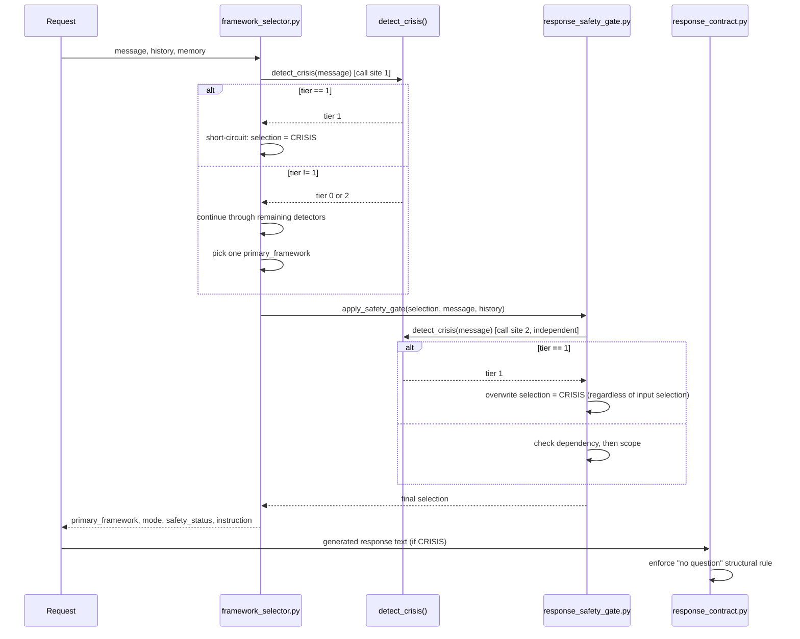

# ADR-0001: Layered Crisis Detection as Intentional Defense-in-Depth

- Status: Accepted
- Date: 2026-07-26
- Deciders: SoulMap AI maintainers
- Related: [Issue #134](https://github.com/tuanductran/soulmap-ai/issues/134)
  (review that produced this decision), [Issue #148](https://github.com/tuanductran/soulmap-ai/issues/148)
  (this ADR), [Epic #129](https://github.com/tuanductran/soulmap-ai/issues/129)

## Status

Accepted. This ADR records a decision that is already implemented in the
current codebase; it introduces no new components and changes no runtime
behavior. It exists to make a decision that was previously scattered across
a PR review and `docs/engineering/crisis-detection-layering-review.md`
permanent, discoverable, and binding on future contributors.

## Context

SoulMap AI follows a knowledge-first architecture: Markdown under `skills/`
is the source of truth for what SoulMap knows and how it should speak, and
the Python runtime under `src/soulmap/runtime/` is responsible only for
orchestration, routing, validation, packaging, and safety enforcement. Crisis
handling sits inside that runtime layer, and is the most safety-critical
decision the runtime makes on any given request.

Today, `detect_crisis()` (`src/soulmap/runtime/detectors/crisis_detector.py`)
is called from two independent locations on every request:

1. `framework_selector.select_framework_async()`
   (`src/soulmap/runtime/routing/framework_selector.py`), which calls it
   first, before any other detector, and short-circuits to a `CRISIS`
   selection on a tier-1 result.
2. `apply_safety_gate()`
   (`src/soulmap/runtime/guards/response_safety_gate.py`), which calls it
   again, independently, on the raw message, and unconditionally overwrites
   whatever selection it was handed with `CRISIS` on a tier-1 result.

Because every one of the selector's return branches calls the safety gate
before returning, `detect_crisis()` runs exactly twice per request today, on
identical input, with no caching between the two calls.

A contributor reading this code for the first time, without this ADR, is
likely to see two calls to the same deterministic function on the same
input and conclude it is redundant, dead weight, or leftover from a refactor,
and simplify it down to one call. [Issue #134](https://github.com/tuanductran/soulmap-ai/issues/134)
was opened specifically to answer whether that instinct is correct. It
concluded, based on code inspection, test behavior, and documentation
evidence (not assumption), that the duplication is intentional. That
conclusion previously lived only in the issue review, in
`docs/engineering/crisis-detection-layering-review.md`, and in PR
discussion. None of those are load-bearing, permanent architectural record:
review documents can be treated as historical, and PR discussion is not
discoverable by someone who lands directly on the code years later. This
ADR is that permanent record.

## Problem Statement

Without a permanent Architecture Decision Record, a future contributor -
human or an AI coding agent operating on this repository - may:

- Remove the selector's own crisis short-circuit, treating the gate's check
  as sufficient on its own.
- Remove the gate's independent re-check, treating the selector's decision
  as already trustworthy.
- Merge the two calls into a single shared check, reasoning that calling a
  pure function twice on the same input is wasted work.

Each of these changes looks like a safe simplification in isolation. Each
one silently removes a real safety property, described in the
[Rationale](#rationale) section below, without breaking any currently
existing test, because the two layers agree on every input by construction
(see [Alternatives Considered](#alternatives-considered)) - the tests that
would fail are the ones a future regression would need, not the ones
duplication protects today.

## Decision

**Keep both crisis-detection call sites.** The selector's own check and the
safety gate's independent re-check are both permanent, required parts of
the request pipeline. This is a defense-in-depth architecture, not
duplicated logic in need of consolidation, and it must not be simplified to
a single call site.

This decision applies specifically to the *routing/enforcement* duplication
between `framework_selector.py` and `response_safety_gate.py`. It does not
mandate duplicating the underlying detection logic itself: both call sites
must continue to share the single `detect_crisis()` implementation
(and its backing multilingual phrase packs) as the one source of truth for
what counts as a crisis signal. What is duplicated is the *act of checking*,
not the *definition* of what is being checked for.

## Rationale

The two call sites protect against different failure modes, and neither one
subsumes the other:

- **The selector's check exists to short-circuit early.** Running the
  crisis check first, before any other detector, means a tier-1 message
  skips the rest of detection entirely and routes directly to `CRISIS`.
  This is a routing-efficiency and clarity property, not a safety
  redundancy by itself.
- **The gate's check exists as a selector-independent safeguard.** The gate
  re-derives the crisis tier from the raw message rather than trusting the
  `selection` field it was handed. This means a future bug in
  `framework_selector.py` - for example, a new early-return branch added
  for some other framework that forgets to check crisis first - is still
  caught, provided that branch still reaches the gate (which, by the
  selector's current structure, every branch does).
- **The gate is also a standalone entrypoint.** `response_safety_gate.py`
  is independently invocable as its own CLI
  (`python -m soulmap.runtime.guards.response_safety_gate`), documented in
  [`docs/engineering/API.md`](../API.md#safety-gate) with its own JSON
  contract. In that context, the gate's own `detect_crisis()` call is not
  redundant at all - it is the only crisis check that runs, because there
  is no selector in the loop.
- **The test suite already treats the gate as not trusting its caller.**
  `tests/contract/test_response_safety_gate.py::test_safety_gate_overrides_crisis`
  calls `apply_safety_gate` directly with a selection that already claims a
  non-crisis framework, simulating a selector that failed to catch a
  tier-1 message, and asserts the gate still produces `CRISIS`. This is the
  behavioral signature of an intentional second checkpoint.
- **Both layers are separately listed as must-stay-stable** in
  [`docs/engineering/maintenance-boundary.md`](../maintenance-boundary.md),
  rather than one being treated as the "real" layer and the other as
  optional.

This reasoning generalizes beyond crisis detection: it is the same
principle documented for the full pipeline in
[`docs/engineering/safety-architecture.md`](../safety-architecture.md)
("Why safety is layered instead of centralized") - detection can miss a
signal, routing can contain a logic bug, structure can be safe but
formatted wrong, and content can be structurally fine but semantically
unsafe. Each layer is narrow and independently testable specifically
because it does not share the others' blind spots.

## Layer Responsibilities

This ADR records five layers relevant to a crisis-tier request. Full detail
for each lives in the linked documents; this table exists to make the
ownership boundary explicit as part of the decision record itself.

| Layer | Location | Responsibility | Detail |
| --- | --- | --- | --- |
| Detector pipeline | [`runtime/detectors/crisis_detector.py`](../../../src/soulmap/runtime/detectors/crisis_detector.py) | Deterministic keyword/regex scan of a single message. Returns a tier (0/1/2) plus response guidance. The single source of truth both call sites depend on. | [`safety-architecture.md`, Layer 1](../safety-architecture.md#layer-1-detector-pipeline) |
| Framework selector | [`runtime/routing/framework_selector.py`](../../../src/soulmap/runtime/routing/framework_selector.py) | Calls the crisis detector first, before any other detector; short-circuits to `CRISIS` on tier 1; hands its result to the safety gate on every return branch. | [`safety-architecture.md`, Layer 2](../safety-architecture.md#layer-2-framework-selector-routing) |
| Safety Gate | [`runtime/guards/response_safety_gate.py`](../../../src/soulmap/runtime/guards/response_safety_gate.py) | Independently re-derives crisis, dependency, and scope status from the raw message; unconditionally overrides the selection on a tier-1 result regardless of what the selector decided. Also independently callable as a CLI. | [`safety-architecture.md`, Layer 3](../safety-architecture.md#layer-3-safety-gate) |
| Response contract validation | [`runtime/guards/response_contract.py`](../../../src/soulmap/runtime/guards/response_contract.py) | Given a `primary_framework == CRISIS` label, enforces structural rules (no question) on the generated response. Does not re-derive the crisis label. | [`safety-architecture.md`, Layer 4](../safety-architecture.md#layer-4-response-contract-validation) |
| Response-content validation | `devtools/evals/eval_responses.py`, `evals/datasets/response_generation_cases.json` | Offline eval-harness check that CRISIS-labeled generated responses contain correct content. Not part of the live request path. | [`crisis-detection-layering-review.md`](../crisis-detection-layering-review.md#current-architecture) |

## Execution Order

Ordering guarantees this ADR depends on, and that must be preserved by any
future change to the selector or gate:

1. The crisis check in the selector always runs before any other detector.
2. Every return branch in the selector calls the safety gate before
   returning to the caller. There is no branch that skips it.
3. The gate's crisis check always runs before its dependency and scope
   checks, and always operates on the raw message rather than trusting the
   `selection` field.
4. A tier-1 result from either call site takes unconditional priority over
   any other selection; overrides replace the selection wholesale, they do
   not merge with it.

## Why Removing Either Layer Weakens Safety

- **Removing the selector's check** does not remove crisis protection
  outright, since the gate still runs on every branch and would still
  catch a tier-1 message - but it removes the selector's own defense
  against a future gate-side regression, and it removes the ability to
  short-circuit the rest of detector work for tier-1 messages, which exists
  for both clarity and efficiency.
- **Removing the gate's check** removes the only safeguard against a
  selector logic bug in any of its return branches, and removes the gate's
  value as a standalone, selector-independent entrypoint - a real
  deployment shape today, not a hypothetical one, since the gate ships as
  its own documented CLI.
- **Merging the two calls into one shared check point** (for example,
  caching the first result and passing it to the gate) would eliminate the
  gate's defining property: that it does not trust its caller. A cached
  result is, by definition, trusting the caller's prior computation. This
  would look like a safe optimization and would pass every test that exists
  today, because both calls currently agree on every input - the property
  it would remove is specifically the protection against a future
  disagreement caused by a selector-side bug, which by construction cannot
  be observed by testing today's behavior.

## Alternatives Considered

**Option A: consolidate into a single crisis check.**
Rejected. This was the instinctive "obvious cleanup" the duplication
invites, and is exactly the change this ADR exists to prevent. It would
remove the gate's selector-independence, described above, for a
maintainability gain that the [#134 review](../crisis-detection-layering-review.md#architectural-trade-offs)
found to be small in practice, since both call sites already share one
detection implementation rather than maintaining two.

**Option B: remove the gate's check only, keep the selector's.**
Rejected. This would remove the only safeguard against a selector-side
routing bug, which is the specific failure mode the gate exists to catch.
It would also remove the gate's ability to function correctly as a
standalone CLI entrypoint independent of the selector.

**Option C: remove the selector's check only, keep the gate's.**
Rejected. This would still preserve crisis protection, since the gate runs
unconditionally on every branch, but it would remove the selector's own
defense against a future gate-side regression and remove the short-circuit
efficiency gain for tier-1 messages. The [#134 review](../crisis-detection-layering-review.md#defense-in-depth-evaluation)
found this reduces fault tolerance for a different failure mode than Option
B, and is not risk-free either.

**Option D (chosen): keep both layers, document the ownership boundary.**
Accepted. The duplication is genuine defense-in-depth against
routing/selection logic bugs specifically - not against detector false
negatives, since both calls share the same deterministic `detect_crisis()`
function and therefore cannot disagree on a given input today. The
maintenance cost is low because there is one detection implementation, not
two, so there is no drift risk between the call sites. This is the option
[#134](https://github.com/tuanductran/soulmap-ai/issues/134) recommended,
and what this ADR now makes permanent.

## Consequences

**Positive:**

- A future selector-side routing bug that fails to preserve the
  "crisis first" invariant is still caught by the gate, provided the
  bug's branch still calls `apply_safety_gate` (see
  [Implementation Boundaries](#implementation-boundaries)).
- The safety gate remains usable as a standalone, selector-independent
  entrypoint with its own documented contract.
- The rationale for the duplication is now discoverable directly from the
  code path and from repository documentation, rather than only from
  historical PR/issue discussion.

**Negative / accepted trade-offs:**

- `detect_crisis()` runs twice per request, on identical input, with no
  caching between the two calls. This is an accepted, deliberate
  performance cost, not an oversight, per the
  [#134 review's trade-off analysis](../crisis-detection-layering-review.md#architectural-trade-offs).
- A contributor changing `detect_crisis()`'s signature or return contract
  must consider both call sites. This is mitigated by both files importing
  the same single-source-of-truth function rather than reimplementing
  detection logic, but it is still a real (small) coordination cost.
- If crisis detection ever moves from a deterministic function to a
  non-deterministic (for example, model-based) classifier, the "free"
  consistency between the two calls that this ADR relies on would become a
  real cost (two model calls, or a risk of disagreement between them). That
  scenario is out of scope for this ADR and would require revisiting this
  decision - see [Future Maintenance Guidance](#future-maintenance-guidance).

## Implementation Boundaries

This ADR is a documentation-only decision. It does not authorize, and was
not produced by, any of the following:

- Changing the behavior of `detect_crisis()`, `framework_selector.py`, or
  `response_safety_gate.py`.
- Changing routing or override priority order.
- Adding a shared cache or memoization between the two call sites.
- Introducing a new safety layer beyond the five described here.

The regression gap inherited from the
[#134 review's recommendation](../crisis-detection-layering-review.md#recommendation)
is covered by `tests/regression/test_routing_safety_gate.py`. Its
`test_safety_gate_overrides_tier1_crisis_when_selector_misses_it` scenario
forces the selector's locally imported `detect_crisis()` to return Tier 0 for
a real Tier 1 message. The gate retains its separate detector import, so the
test proves it independently re-derives the raw message and overrides the
selector result to `CRISIS` through the full pipeline.

## Future Maintenance Guidance

- **Do not remove either `detect_crisis()` call site** without opening a
  new ADR that supersedes this one and re-evaluating the defense-in-depth
  argument above.
- **When adding a new return branch to `framework_selector.py`**, verify it
  still calls `apply_safety_gate` before returning. The parametrized routing
  regression in `tests/regression/test_routing_safety_gate.py` protects the
  current branch set, and the selector-miss scenario proves the gate's
  independent crisis override. Extend those tests whenever selector branching
  changes, per
  [`safety-architecture.md`'s ordering notes](../safety-architecture.md#request-flow-end-to-end).
- **When changing `detect_crisis()`'s signature or return contract**,
  update both call sites together; they must continue to share one
  implementation rather than drift into two.
- **If a non-deterministic crisis classifier is ever proposed**, this ADR
  must be revisited before implementation, since the current rationale
  depends on both calls being deterministic and therefore incapable of
  disagreeing on the same input.
- **Do not use this duplication as a template** for other detectors by
  default. This ADR documents why crisis detection specifically warrants a
  second, selector-independent checkpoint (it is the highest-priority,
  highest-consequence signal in the pipeline). Extending the same pattern
  to a lower-priority detector should be argued for on its own merits, not
  assumed from this precedent.

## Related Documents

- [`docs/engineering/crisis-detection-layering-review.md`](../crisis-detection-layering-review.md),
  the full evidence-gathering review this ADR is based on
- [`docs/engineering/safety-architecture.md`](../safety-architecture.md),
  the end-to-end pipeline this decision is one part of
- [`docs/engineering/safety-enforcement-matrix.md`](../safety-enforcement-matrix.md),
  evidence map from `SOULMAP.md` rules to code, tests, and evals
- [`docs/engineering/maintenance-boundary.md`](../maintenance-boundary.md),
  which lists both `framework_selector.py` and `response_safety_gate.py` as
  core, must-stay-stable files
- [`docs/engineering/API.md`](../API.md), CLI/JSON contracts for the
  selector and the safety gate
- [Issue #134](https://github.com/tuanductran/soulmap-ai/issues/134),
  the review that produced this decision
- [Issue #148](https://github.com/tuanductran/soulmap-ai/issues/148), the
  issue this ADR closes
