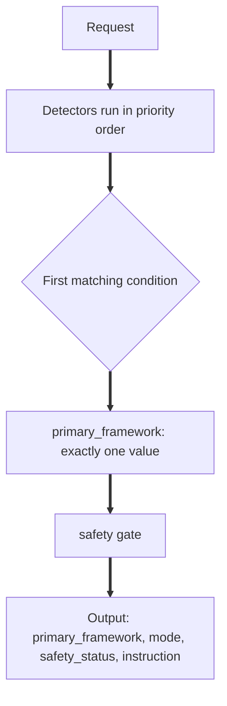

# Known Architecture Limitations

This document is the canonical reference for SoulMap AI's intentional
architectural limitations and boundaries.

Every entry here describes a deliberate design decision, not a defect.
Each limitation exists because relaxing it would create a specific risk
that outweighs any gain.

This document does not duplicate content that already lives authoritatively
elsewhere. Where a limitation is already described in full in another
document, this file summarizes the boundary and links to the authoritative
source.

**Audience:** contributors, reviewers, AI agents, and anyone evaluating
whether a proposed change is consistent with the project's design.

**Related documents:**

- [`SOULMAP.md`](../../SOULMAP.md) - baseline doctrine, safety law, and
  shipped package contract
- [`docs/engineering/repo-contract.md`](repo-contract.md) - structural
  source of truth for every top-level repository surface
- [`docs/engineering/safety-architecture.md`](safety-architecture.md) -
  end-to-end request pipeline and layer ownership
- [`docs/engineering/knowledge-architecture.md`](knowledge-architecture.md)
  - how the runtime loads knowledge from Markdown and which modules are
  protected

---

## Summary table

| Limitation | Category | Section |
| --- | --- | --- |
| Python does not generate AI responses | Intentional design | [AI response generation](#ai-response-generation) |
| Markdown owns all knowledge content | Intentional design | [Markdown knowledge ownership](#markdown-knowledge-ownership) |
| Python is orchestration only | Intentional design | [Python runtime responsibilities](#python-runtime-responsibilities) |
| Safety enforcement is deterministic only | Intentional design | [Safety enforcement boundaries](#safety-enforcement-boundaries) |
| Exactly one primary framework per request | Intentional design | [Routing boundaries](#routing-boundaries) |
| Only two shipping artifact formats | Implementation boundary | [Packaging boundaries](#packaging-boundaries) |
| `SOULMAP.md` is the only doctrine source | Intentional design | [Documentation ownership](#documentation-ownership) |
| Architecture decisions are recorded in ADRs | Intentional design | [Architecture ownership](#architecture-ownership) |
| Crisis detection supports five languages only | Current limitation | [Language limitations](#language-limitations) |
| Evals do not score LLM response quality | Intentional design | [Evaluation limitations](#evaluation-limitations) |
| Content changes belong in Markdown | Contributor expectation | [Contributor expectations](#contributor-expectations) |

---

## AI response generation

### What it is

SoulMap's Python runtime does not generate AI responses. It routes, validates,
packages, and enforces safety. The underlying language model produces response
text. The Python layer never writes, rewrites, or synthesizes what the model
returns.

### Why it exists

SoulMap follows a knowledge-first architecture. The content of a response -
its wording, tone, and emotional register - belongs to Markdown under `skills/`
and `SOULMAP.md`, not to executable Python. Generating responses in Python would
couple content decisions to code changes, making it impossible to update
SoulMap's voice or doctrine without modifying and re-testing the runtime.

### Why it is intentional

The hard boundary between "Python enforces" and "Markdown defines" is what
makes the system auditable. Every constraint on response structure can be
read in a Markdown file without reading Python source.

### Benefits

- Content changes do not require Python expertise or a Python deployment.
- Safety properties can be reviewed in Markdown before they are wired into
  enforcement code.
- The runtime can be independently tested against Markdown contracts without
  an LLM.

### Implementation boundary

```mermaid
flowchart LR
    A[Framework selector\n+ safety gate\ndecide routing] ==> B[LLM generates\nresponse text\nfollowing the instruction]
    B ==> C[response_contract.py\nstructure validation]
    B ==> D[resource_sanitizer.py\nbanned vocabulary]
    B ==> E[response_safety_contract.py\ncontent safety]
    C ==> F{All PASS?}
    D ==> F
    E ==> F
    F -- no ==> G[Rewrite required]
    F -- yes ==> H[Response delivered]
```

The three response validators in `src/soulmap/runtime/guards/` check generated
text; they never produce it.

### Related documentation

- [`docs/engineering/safety-architecture.md`](safety-architecture.md), Layer 4 section
- [`docs/engineering/API.md`](API.md) for the selector's output contract

### Related implementation

- `src/soulmap/runtime/guards/response_contract.py`
- `src/soulmap/runtime/guards/resource_sanitizer.py`
- `src/soulmap/runtime/guards/response_safety_contract.py`

---

## Markdown knowledge ownership

### What it is

Detection phrases, framework response structures, voice rules, safety
doctrine, and brand guidance all live in `skills/` or `SOULMAP.md` as
Markdown. Python reads these files at import time but never originates their
content.

### Why it exists

The core architectural principle is: one place to make a content change, one
tool to verify it took effect. If detection phrases lived in Python, a
maintainer editing SoulMap's tone would need to understand both the Markdown
and the Python data structures that load from it. That duplication creates
silent drift: the Markdown says one thing, the runtime does another.

### Why it is intentional

Markdown ownership is the foundation that makes `soulmap audit-knowledge`
meaningful. The audit tool traces runtime imports and cross-references them
against Markdown content. That cross-reference is only possible because there
is exactly one authoritative location per piece of content.

### Benefits

- A content change only touches a Markdown file.
- The `soulmap audit-knowledge` command verifies ownership automatically.
- Contributors without Python expertise can review and modify behavioral content.
- Detection behavior and documented framework knowledge cannot silently drift apart.

### Implementation boundary


The one intentional exception is crisis detection, which uses hardcoded
Python constants rather than Markdown-loaded phrase lists. That exception is
documented fully in the protected-modules section of
[`knowledge-architecture.md`](knowledge-architecture.md#protected-modules)
and summarized in the [Language limitations](#language-limitations) section
below.

### Related documentation

- [`docs/engineering/knowledge-architecture.md`](knowledge-architecture.md)
  - authoritative description of how the runtime loads Markdown, which
  modules are the protected exception, and the guidelines for changing the
  knowledge layer
- [`SOULMAP.md`](../../SOULMAP.md), "Knowledge file usage" section

### Related implementation

- `src/soulmap/runtime/knowledge/keyword_lists.py`
- `src/soulmap/runtime/knowledge/pattern_source.py`
- `skills/` - all shipped knowledge files

---

## Python runtime responsibilities

### What it is

The Python runtime in `src/soulmap/runtime/` is responsible for exactly five
things: orchestration, routing, validation, packaging, and safety enforcement.
It is not responsible for generating responses, defining brand voice, writing
framework content, or making content decisions.

### Why it exists

Keeping Python's scope narrow is what makes the system testable in isolation.
Routing, validation, and safety enforcement can be unit-tested and evaluated
without invoking an LLM. If Python also generated content, those same tests
would need to mock or call an LLM, making the test suite brittle and
environment-dependent.

### Why it is intentional

The split also enforces a contribution discipline: if a contributor finds
themselves editing Python to change what SoulMap says or believes rather than
how it routes or validates, that is a signal the change belongs in Markdown
instead. `SOULMAP.md` names this boundary explicitly under "Knowledge file
usage."

### Benefits

- The runtime is independently testable.
- Safety enforcement can be verified without an LLM.
- Contributors know exactly where content changes go.

### Implementation boundary

| Python layer | Responsible for | Not responsible for |
| --- | --- | --- |
| `src/soulmap/runtime/detectors/` | Signal detection from message text | Deciding what a signal means for routing |
| `src/soulmap/runtime/routing/` | Framework selection and priority | Generating the response for the selected framework |
| `src/soulmap/runtime/guards/` | Response structure and content safety validation | Rewriting or generating response text |
| `src/soulmap/runtime/knowledge/` | Parsing Markdown phrase lists into Python data | Authoring those phrase lists |
| `src/soulmap/devtools/` | CLI tooling: format, lint, eval, build | Product behavior |

### Related documentation

- [`docs/engineering/repo-contract.md`](repo-contract.md), Top-Level Contract table
- [`docs/engineering/safety-architecture.md`](safety-architecture.md)

### Related implementation

- `src/soulmap/runtime/` - full runtime source
- `src/soulmap/devtools/` - full tooling source

---

## Safety enforcement boundaries

### What it is

SoulMap's runtime safety enforcement uses deterministic, pattern-based
detection: regex and substring matching only. It does not perform semantic
understanding, intent classification, or probabilistic scoring of whether a
response is safe.

### Why it exists

Deterministic enforcement produces results that can be audited without
running an LLM. A regex match either fires or it does not. This makes
enforcement behavior testable with unit tests rather than requiring expensive
LLM-in-the-loop evaluation.

The safety gate and response validators check specific, enumerable categories:

- crisis tier (exact phrase list)
- dependency reinforcement (specific banned patterns)
- diagnosis claims (word-list match)
- prediction presented as fact (phrase-level detection)
- guru positioning (pattern match)
- excessive certainty (phrase-level detection)
- structural rules: question count, semicolons, bullet points

### Why it is intentional

Semantic safety classification at inference time would introduce failure modes
that are difficult to test and harder to reason about. A deterministic system
can be exhaustively enumerated; a semantic one cannot.

The trade-off is acknowledged: deterministic detection can miss novel phrasings
of prohibited content. That limitation is addressed through defense-in-depth
(three separate validator layers, plus pre-response routing checks) rather than
by replacing deterministic enforcement with probabilistic classification.

### Benefits

- All safety behavior is fully testable without an LLM.
- Safety failures have a clear, inspectable cause.
- The safety evaluation suite (`tests/eval_regression/test_safety_evals.py`)
  can run in CI without LLM dependencies.

### Implementation boundary

The three response validators are the only mechanism for post-generation safety
enforcement. They fire after the LLM produces text and before it reaches the
user. They detect violations; they do not rewrite responses. A flagged response
requires human or LLM rewrite before delivery.

Pre-generation routing (the framework selector and safety gate) uses the same
deterministic detection approach for routing decisions.

### Related documentation

- [`docs/engineering/safety-architecture.md`](safety-architecture.md),
  "Layer 4" and "Why safety is layered instead of centralized" sections
- [`docs/engineering/safety-enforcement-matrix.md`](safety-enforcement-matrix.md)
  - the rule-by-rule mapping of `SOULMAP.md` safety rules to code, tests,
  and evals with current enforcement status
- [`docs/engineering/API.md`](API.md#response-safety-contract-validator)

### Related implementation

- `src/soulmap/runtime/guards/response_safety_contract.py`
- `src/soulmap/runtime/guards/response_contract.py`
- `src/soulmap/runtime/guards/resource_sanitizer.py`
- `src/soulmap/runtime/guards/response_safety_gate.py`
- `tests/eval_regression/test_safety_evals.py`

---

## Routing boundaries

### What it is

The framework selector produces exactly one primary framework per request.
Framework combination is not a runtime concept. The `secondary_layer` field
in selector output is an annotation only; it is never used to activate a
second primary framework simultaneously.

### Why it exists

`SOULMAP.md`'s framework-selection rules require exactly one primary framework
at a time: "apply exactly one primary framework at a time" and "never combine
two primary frameworks in one response." Implementing combination at the
routing layer would violate the core doctrine.

The priority ordering (crisis > dependency > sanctuary > grief > ... > mirror)
exists so that when multiple signals are present, there is always an
unambiguous winner. Combination logic would create ambiguity about how to
merge two frameworks' response structures and would be impossible to test
exhaustively.

### Why it is intentional

Single-framework routing is both a doctrine requirement and an engineering
simplification. Every branch in `framework_selector.py` terminates in a
single `primary_framework` value. The safety gate can re-derive crisis and
dependency from the raw message and compare against the selector's output
precisely because there is one selection to compare against.

### Benefits

- Selection is deterministic and fully testable.
- The safety gate's override logic is unambiguous.
- `SOULMAP.md` priority rules map directly to framework-selector code.

### Implementation boundary



The selector returns `primary_framework` as a single string. There is no
array variant, no combined-framework variant, and no mechanism for routing
to fall through to multiple frameworks simultaneously.

### Related documentation

- [`docs/engineering/safety-architecture.md`](safety-architecture.md),
  "Layer 2, framework selector" and "Priority order and override behavior" sections
- [`SOULMAP.md`](../../SOULMAP.md), "Framework selection" section
- [`skills/meta/orchestration.md`](../../skills/meta/orchestration.md)
  - doctrine-level decision tree that mirrors the Python selector's ordering
- [`docs/engineering/API.md`](API.md#framework-selector)
  - selector JSON contract

### Related implementation

- `src/soulmap/runtime/routing/framework_selector.py`

---

## Packaging boundaries

### What it is

The SoulMap build system produces exactly two distribution artifacts:
`dist/soulmap-ai.zip` and `dist/soulmap-ai.skill`. The content of each is
fixed by [`docs/engineering/repo-contract.md`](repo-contract.md).

`templates/` is excluded from both artifacts. It is internal-only. The
`.claude/` local workflow layer is excluded from both artifacts.
`.claude-plugin/` is included only in `dist/soulmap-ai.skill`, not in
`dist/soulmap-ai.zip`.

### Why it exists

Packaging scope is fixed so that what ships can be verified by extraction
checks in CI and in the release workflow. If the artifact contents were
unbounded, the verification step would have no expected state to compare
against.

### Why it is intentional

The two-artifact model separates standard knowledge extraction (zip) from
skill-package tooling (skill). A consumer using document-style AI tooling
does not receive the `.claude-plugin/` metadata, which is relevant only to
skill-oriented environments.

### Benefits

- Packaging is verifiable in CI.
- Internal-only content (`templates/`, `.claude/`) cannot accidentally ship.
- Skill-package consumers receive the `.claude-plugin/` metadata they need;
  standard consumers do not receive noise.

### Implementation boundary

| Artifact | Includes | Excludes |
| --- | --- | --- |
| `dist/soulmap-ai.zip` | `skills/`, `SKILL.md`, `SOULMAP.md`, `LICENSE` | `templates/`, `.claude/`, `.claude-plugin/` |
| `dist/soulmap-ai.skill` | zip contents plus `.claude-plugin/` | `templates/`, `.claude/` |

### Related documentation

- [`docs/engineering/repo-contract.md`](repo-contract.md), Top-Level Contract table
- [`docs/operations/UPLOAD.md`](../operations/UPLOAD.md)

### Related implementation

- `src/soulmap/devtools/` - build CLI entry points
- `.distignore` - exclusion list for build packaging
- `.github/workflows/release.yml` - release packaging steps

---

## Documentation ownership

### What it is

SoulMap has exactly one source of truth for each documentation concern:

- `SOULMAP.md` owns baseline doctrine, safety rules, framework hierarchy,
  response behavior, and shipped package guidance.
- `AGENTS.md` owns the baseline contract for AI coding agents working in this
  repository: project shape, build and test commands, and workflow rules. It
  is not shipped and does not restate SoulMap doctrine.
- `docs/engineering/repo-contract.md` owns the structural source of truth
  for every repository surface.
- `docs/` owns explanatory and operational documentation for contributors,
  testers, and operators.
- `skills/` owns shipped knowledge content: framework text, voice rules,
  brand doctrine, safety knowledge.
- `templates/` owns internal-only product and brand copy that does not ship.

No documentation concern is split across multiple authoritative sources.
Cross-references are acceptable; duplication of authoritative content is not.

### Why it exists

Duplicated documentation creates drift. If `SOULMAP.md` and a `docs/` file
both claim to define the framework priority hierarchy, they will eventually
disagree. The `repo-contract.md` drift rules enforce that each important repo
surface is documented once as the primary source of truth.

### Why it is intentional

Single-source documentation is the same principle applied to documentation
that Markdown knowledge ownership applies to content. One place to change a
rule means one place to get it wrong, but also one place to audit.

### Benefits

- A contributor updating a rule knows where the canonical version lives.
- Documentation reviews have a clear locus.
- CI Markdown contract checks can validate that documented structures match
  actual repository state.

### Implementation boundary

When this document or any `docs/` file mentions a rule that is already
authoritative in `SOULMAP.md` or `repo-contract.md`, it links to that source
rather than restating the rule. `SOULMAP.md` is never overridden by `docs/`.

### Related documentation

- [`docs/engineering/repo-contract.md`](repo-contract.md), "Drift rules" section
- [`SOULMAP.md`](../../SOULMAP.md), "Working rules for AI agents" section

---

## Architecture ownership

### What it is

Binding architectural decisions are recorded as Architecture Decision Records
(ADRs) in `docs/engineering/adr/`. ADRs are permanent and immutable once
accepted. They document the decision itself, the context that drove it, the
alternatives considered, and the rationale for the choice made.

### Why it exists

Architectural decisions that are not recorded get re-litigated. If the
reasons for a decision are not captured, future contributors may reverse it
without understanding the tradeoffs. ADRs make the "why not the alternative"
argument durable.

The crisis detection duplication ADR
([`docs/engineering/adr/0001-layered-crisis-detection.md`](adr/0001-layered-crisis-detection.md))
is the canonical example: it permanently records why the crisis detector runs
twice per request and what class of selector bug that duplication protects
against. Without it, the duplication would appear as dead code to be cleaned
up.

### Why it is intentional

Architecture ownership through ADRs creates a review surface. A proposed
change that conflicts with an existing ADR requires explicitly revisiting the
ADR before the change can proceed. That process is visible in code review.

### Benefits

- Architectural decisions cannot be accidentally reversed.
- Reviewers have a canonical reference for the "why" behind structural choices.
- New contributors can reconstruct the reasoning history.

### Implementation boundary

ADRs live in `docs/engineering/adr/`. They are documentation artifacts only;
no executable code lives in that directory. An ADR is considered binding until
it is superseded by a newer ADR that explicitly replaces it.

### Related documentation

- [`docs/engineering/adr/0001-layered-crisis-detection.md`](adr/0001-layered-crisis-detection.md)
  - the permanent decision record for dual crisis detection call sites
- [`docs/engineering/crisis-detection-layering-review.md`](crisis-detection-layering-review.md)
  - the full defense-in-depth argument that the ADR codifies

---

## Language limitations

### What it is

Crisis detection currently supports five languages: English (`en`), Vietnamese
(`vi`), Spanish (`es`), French (`fr`), and Chinese (`zh`). Each language is a
static, hardcoded Python module with three manually authored phrase tuples:
`CRISIS_TIER1`, `CRISIS_TIER2`, and `GRANDIOSITY_SIGNALS`.

Adding a language requires adding a new `safety_<code>.py` module and
importing it from `crisis_language_packs.py`. No other part of the detection
pipeline changes.

### Why it exists

Crisis detection is the one deliberate exception to the Markdown knowledge
ownership rule. The full rationale is in
[`knowledge-architecture.md`](knowledge-architecture.md#protected-modules):
a parsing error or incomplete Markdown loading path could miss a genuine
crisis signal. Static Python eliminates that failure mode. Crisis phrase lists
are authored by humans for safety and must be explicit and reviewable.

### Why it is intentional

The five-language limit is current state, not a permanent ceiling. Each
language requires careful human authorship of crisis phrases. The bar for
adding a language is not technical difficulty but the availability of a
qualified author who can verify the phrase list is clinically appropriate.

Any proposal to migrate crisis detection to Markdown loading requires a full
pass of the safety and crisis evaluation suites before and after the change,
independent verification that every signal variant is preserved, and explicit
sign-off that the Markdown parsing path is reliable enough for safety use. The
default answer to that migration is no.

### Benefits

- Static phrase lists are reviewable without runtime knowledge.
- Crisis detection cannot break due to a Markdown parsing error.
- Each supported language's phrase list is explicit and auditable.

### Current language scope

| Language | Module | Scope |
| --- | --- | --- |
| English | `config/safety_en.py` | Crisis tier 1, tier 2, grandiosity signals |
| Vietnamese | `config/safety_vi.py` | Crisis tier 1, tier 2, grandiosity signals |
| Spanish | `config/safety_es.py` | Crisis tier 1, tier 2, grandiosity signals |
| French | `config/safety_fr.py` | Crisis tier 1, tier 2, grandiosity signals |
| Chinese | `config/safety_zh.py` | Crisis tier 1, tier 2, grandiosity signals |

Non-crisis detection (framework routing, dependency, emotional intensity, and
all topic-framework detectors) is language-unaware and operates on English
text only.

### Implementation boundary

The five language packs are combined by `crisis_language_packs.py`. That
module is a direct Python import, not a Markdown loader. `crisis_detector.py`
calls the combined pack; it has no knowledge of which language matched.

### Related documentation

- [`docs/engineering/knowledge-architecture.md`](knowledge-architecture.md#protected-modules)
  - the authoritative rationale for the protected-module exception
- [`SOULMAP.md`](../../SOULMAP.md), "Non-negotiable safety rules", Rule 1

### Related implementation

- `src/soulmap/runtime/config/safety_en.py`
- `src/soulmap/runtime/config/safety_vi.py`
- `src/soulmap/runtime/config/safety_es.py`
- `src/soulmap/runtime/config/safety_fr.py`
- `src/soulmap/runtime/config/safety_zh.py`
- `src/soulmap/runtime/knowledge/crisis_language_packs.py`
- `src/soulmap/runtime/detectors/crisis_detector.py`

---

## Evaluation limitations

### What it is

The SoulMap evaluation suite (`soulmap eval-responses`, `soulmap eval-groups`,
`soulmap eval-markdown-contracts`) tests routing correctness, framework
grouping, response structure contracts, and Markdown contract sync. It does not
score or evaluate the quality, tone, or emotional appropriateness of LLM
response text.

### Why it exists

The evaluation suite is designed to be runnable in CI without an LLM. It
validates that the routing layer, framework selector, and response validators
behave correctly given known inputs. Evaluating response quality would require
LLM inference and a scoring rubric, both of which introduce inference cost,
non-determinism, and subjective judgment into a CI pipeline.

### Why it is intentional

Routing correctness is fully deterministic and fully testable. Response quality
is not. Mixing the two in the same evaluation suite would obscure routing
failures behind response-quality noise and make failures harder to diagnose.

The evaluation suite is designed as a regression gate, not a quality benchmark.
Its purpose is to catch routing regressions, structural contract violations, and
framework-grouping drift before they reach a release.

### Benefits

- The eval suite runs in CI without an LLM dependency.
- Routing regressions are caught deterministically.
- Evaluation failures have a clear, inspectable cause.

### Current eval scope

| Command | Tests | Does not test |
| --- | --- | --- |
| `soulmap eval-responses` | Response structure contracts, validator behavior | LLM response quality |
| `soulmap eval-groups` | Framework grouping and routing correctness | Routing edge cases outside defined group fixtures |
| `soulmap eval-markdown-contracts` | Markdown contract sync with runtime | Detection phrase completeness |
| `tests/eval_regression/test_safety_evals.py` | Safety-critical routing scenarios | General response quality |

### Related documentation

- [`docs/engineering/TESTER.md`](TESTER.md) - full testing and evaluation workflow
- [`docs/engineering/safety-enforcement-matrix.md`](safety-enforcement-matrix.md)
  - current enforcement status per `SOULMAP.md` rule

### Related implementation

- `evals/` - eval fixtures and grouping definitions
- `src/soulmap/devtools/` - eval CLI entry points
- `tests/eval_regression/test_safety_evals.py`

---

## Contributor expectations

### What it is

The design of this repository creates specific expectations for contributors
that follow directly from the limitations above. These are not preferences;
they are the operational expression of the architectural boundaries.

### Content changes belong in Markdown

If a change modifies what SoulMap says, how it detects a signal, what phrases
trigger a framework, or what voice rules apply, the change belongs in
`skills/` or `SOULMAP.md`. It does not belong in Python.

If a contributor finds themselves editing runtime Python to change what
SoulMap says or believes rather than how it routes or validates, that is a
signal the change belongs in Markdown instead.

### Audit before changing the knowledge layer

Before modifying any detection phrase list or Markdown section that backs a
detector, run `soulmap audit-knowledge` to establish the current state.
Verify Markdown ownership by reading the consuming detector's loading code,
not by inferring it from a constant's name.

### Crisis detection changes require explicit sign-off

Any change to the crisis language packs (`safety_en.py` and equivalents)
requires a full pass of the safety and crisis evaluation suites before and
after the change, independent verification that every signal variant is
preserved, and explicit sign-off that the change does not reduce coverage.

Any proposal to migrate crisis detection from Python constants to Markdown
loading requires the additional conditions documented in
[`knowledge-architecture.md`](knowledge-architecture.md#protected-modules).
The default answer to that migration is no.

### Routing changes require re-verification of priority order

Any change to `framework_selector.py` must preserve the priority ordering
documented in `SOULMAP.md`'s "Framework selection" table and in
`skills/meta/orchestration.md`. After a routing change, verify that the
"every branch reaches the safety gate" property holds: there must be no
branch that returns without calling `apply_safety_gate`.

### ADRs cannot be reversed without a replacement ADR

A change that conflicts with an existing ADR requires a new ADR that
explicitly supersedes the existing one. The replacement ADR must document the
new context, the alternatives considered, and the reason the previous decision
no longer applies.

### Documentation changes must preserve single-source ownership

When adding to `docs/`, cross-reference authoritative sources rather than
restating their content. If a rule lives in `SOULMAP.md`, link to it. Do not
copy it into a `docs/` file. Duplication creates drift.

### Related documentation

- [`CONTRIBUTING.md`](../../CONTRIBUTING.md)
- [`SOULMAP.md`](../../SOULMAP.md), "Working rules for AI agents" section
- [`docs/engineering/knowledge-architecture.md`](knowledge-architecture.md#knowledge-layer-guidelines)

---

## Non-goals

The following are explicitly outside SoulMap's current scope. They are not
planned for the current release train. Future work may revisit some of them,
but no implementation plan exists for any of them at this time.

| Non-goal | Why it is not a goal |
| --- | --- |
| Semantic safety classification | Adds LLM dependency to safety enforcement; deterministic detection is sufficient for the current scope |
| LLM response quality evaluation in CI | Requires LLM inference and non-deterministic scoring; outside the regression gate purpose of the eval suite |
| Framework combination (two active primary frameworks) | Violates `SOULMAP.md` doctrine; makes routing and testing ambiguous |
| Dynamic language expansion without static phrase review | Crisis detection requires human authorship; automated translation is not a substitute |
| Python-generated response content | Violates the knowledge-first architecture; all content belongs in Markdown |
| Per-language framework routing | Framework selection is language-unaware by design; safety detection provides the multilingual layer |
| Markdown-loaded crisis detection | Protected-module policy; default answer is no pending safety evaluation evidence |

---

## Relationship to existing engineering documentation

This document is the entry point for understanding SoulMap's intentional
boundaries. It is not the authoritative source for any individual boundary's
full implementation detail. For full detail, follow the links in each section:

- For the request pipeline end to end, see
  [`safety-architecture.md`](safety-architecture.md).
- For the knowledge loading layer and protected modules, see
  [`knowledge-architecture.md`](knowledge-architecture.md).
- For the rule-by-rule safety enforcement map, see
  [`safety-enforcement-matrix.md`](safety-enforcement-matrix.md).
- For the repository surface contract, see
  [`repo-contract.md`](repo-contract.md).
- For the crisis detection duplication decision, see
  [`adr/0001-layered-crisis-detection.md`](adr/0001-layered-crisis-detection.md).
- For the CLI and JSON contracts, see [`API.md`](API.md).
- For the baseline doctrine and safety rules, see
  [`SOULMAP.md`](../../SOULMAP.md).
